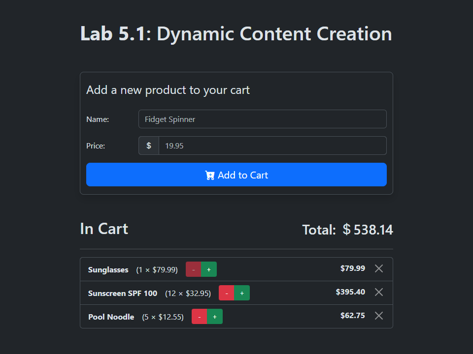

# Lab 5.1: Dynamic Content Creation

[Karl Johnson](https://github.com/hirekarl)  
2025-RTT-30  
<time datetime="2025-06-26">2025-06-26</time>  

## Submission Summary

### Viewer Instructions
View deployed app at ; view solution source below.

### Solution Source
- **HTML**: [`dynamic-shopping-cart/index.html`](./dynamic-shopping-cart/index.html)
- **JavaScript**: [`dynamic-shopping-cart/script.js`](./dynamic-shopping-cart/script.js)
- **CSS**: [`dynamic-shopping-cart/styles.css`](./dynamic-shopping-cart/styles.css)

### Reflection Questions
1. How did you dynamically create and append new elements to the DOM?
> I used event listeners on the form to create new shopping cart list items if the form passed basic HTML validation and if the product name did not already exist in the list (case-insensitive). Otherwise, the form resets. I used *delegated* event listeners on the shopping cart list items themselves to remove items using the `X` button and update quantities with the `-` and `+` buttons.
>
> I took an object-oriented approach to structuring the `shoppingCart` and `Product`s. Instances of `Product` create their own HTML with `Product.createHTML()` and keep a pointer to their own HTML `<li>` elements in an instance property `this.domElement`. Products are added to the `shoppingCart` using `shoppingCart.addProduct()` and removed using `shoppingCart.removeProduct()`.
> 
> Additions to the DOM are optimized and batched using the `DocumentFragment` interface, and when a product's `<li>` is removed from the shopping cart on the DOM, the `Product` instance itself is nullified and all references to it in memory are removed.

2. What steps did you take to ensure accurate updates to the total price?
> Basically, there was a lot of conversion between `Number`s (`float`s) and `String`s to be sure a) math is only being done to two decimal places (or at least float math is *rounded* to two decimal places), and that numerals always appear as decimal numbers to two decimal places to the user.

3. How did you handle invalid input for product name or price?
> Since we just went through JavaScript form validation today in class, I just used the built-in HTML validator attributes: `required` on the `product-name` input, and `step`, `min`, and `required` on the `product-price` input (which is also set to `type="number"` as a type constraint).

4. What challenges did you face when implementing the remove functionality?
> I had more trouble with the increment and decrement buttons on the items in the list, to be honest. Originally, I filled in the buttons with Bootstrap Icons (namely, `bi-dash` and `bi-plus`), but the fact that they are implemented as `<i>` elements with classes, my `click` event listener wasn't registering their parent buttons' classes on `event.target`. At first, it just seemed like it only worked *sometimes*, then I realized it only worked if I clicked on the buttons outside of the center.

## Assignment
### Lab Overview
In this lab, you will create a dynamic shopping cart application to practice and reinforce your DOM manipulation skills. The application will allow users to add, update, and remove items dynamically while keeping track of the total price. This lab focuses on modifying elements, creating and appending new elements, and updating content dynamically using JavaScript.

### Workplace Context
Imagine you are tasked with building the shopping cart feature for an e-commerce website. Customers should be able to:
1. Add items to their cart dynamically.
2. View the items they have added, along with their prices and quantities.
3. Update the quantity of items in the cart, reflecting real-time price changes.
4. Remove items from the cart.

This lab will help you simulate and build core functionality used in modern e-commerce applications.

### Activity Tasks
#### 1. Add Products
- [x] Test adding products with different names and prices.
- [x] Ensure each product appears in the list with the correct price.

#### 2. Remove Products
- [x] Test removing products from the cart.
- [x] Verify that the total price updates accurately after removing items.

#### 3. Edge Cases
- [x] Attempt to add products with empty names or invalid prices and ensure the application handles these cases gracefully.

#### 4. Enhance the App (Optional):
- [x] Allow users to update the quantity of products in the cart and recalculate the total price.